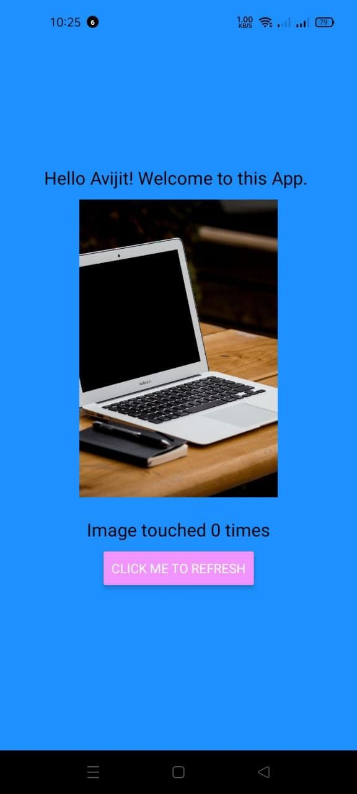

<html>
<head>
</head>

<body>
<h2>If you want to run this project in android ,install expo cli app and click the link bellow.Then scan the QR code and enjoy .....</h2>
<a href="https://expo.dev/@avijit_chy/DoneWithIt">link for project</a>

<h3>project Image</h3>

</body>

</html>
